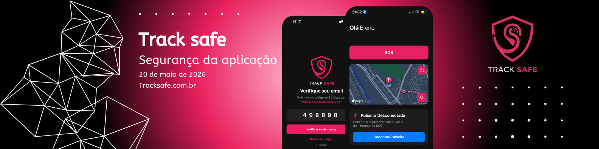

  

# TrackSafe — Segurança da API

[← Voltar ao README](../README.md) · [API](API.md)

Documento de **apresentação pública**: descreve **princípios e controles** adotados no backend, sem expor código-fonte, caminhos internos, nomes de variáveis de ambiente, endpoints sensíveis ou segredos. Detalhes operacionais ficam apenas nos repositórios e ambientes privados da equipe.

---

## Visão geral

A API do TrackSafe trata dados pessoais, localização e eventos de emergência. A segurança é organizada em **camadas complementares**:

| Camada | Objetivo |
|--------|----------|
| **Rede e transporte** | HTTPS na borda; TLS para todo tráfego de tokens e dados pessoais |
| **Acesso HTTP** | CORS restrito em produção; rate limit por IP |
| **Autenticação** | Tokens de acesso e renovação com segredos distintos |
| **Autorização** | Papéis (`user` / `master`) e regra “próprio recurso ou admin” |
| **Integridade** | Preços e totais só no servidor; chave de identidade contra requisições duplicadas |
| **Dados** | Senhas com hash; SQL parametrizado; Postgres com SSL |
| **Tempo real** | WebSocket com isolamento por família (RLS lógica no canal) |
| **Pagamentos e arquivos** | Credenciais só no servidor; uploads com permissão explícita |

---

## 1. CORS (origens cruzadas)

A API utiliza política CORS configurável no servidor HTTP.

| Ambiente | Comportamento recomendado |
|----------|---------------------------|
| **Desenvolvimento** | Pode ser mais permissivo para facilitar testes locais |
| **Produção** | **Restringir** `origin` aos domínios oficiais do app web e do painel administrativo — evitar aceitar qualquer origem (`*`) |

**Por quê:** mesmo com API predominantemente **stateless** (JWT), origens abertas aumentam superfície para abuso de fluxos legados ou integrações indevidas no navegador.

**Ação em produção:** parametrizar lista de domínios permitidos via configuração do provedor de hospedagem, não no repositório público.

---

## 2. Autenticação e regras de acesso

### Tokens (access + refresh)

| Tipo | Uso |
|------|-----|
| **Access token** | Enviado no header `Authorization: Bearer …` em cada requisição autenticada |
| **Refresh token** | Renovacao de sessão; assinado com **segredo diferente** do access token |

Após validação, o contexto da requisição carrega identificador do usuário, e-mail, **papel** e vínculo ao **grupo familiar**, quando aplicável.

### Middlewares de autorização (padrões)

| Padrão | Quem passa |
|--------|------------|
| **Autenticado** | Qualquer utilizador com access token válido |
| **Apenas administrador** | Papel de administrador global (`master`) |
| **Próprio recurso ou admin** | O próprio utilizador (mesmo `id`) **ou** administrador |

Rotas de catálogo, pedidos, pagamentos, SOS e família combinam esses padrões conforme o domínio — sempre validados **no servidor**, nunca só no cliente.

### Papéis

| Papel | Escopo típico |
|-------|----------------|
| **`user`** | Próprios pedidos, perfil, contatos, alertas e dados do seu grupo |
| **`master`** | Operações administrativas: catálogo completo, todos os pedidos, visões amplas de SOS e ferramentas de gestão |

### Segredos

- Segredos de assinatura de tokens devem ser **fortes, únicos e rotacionáveis**.
- Definidos **apenas** no painel do provedor (Render, Railway, etc.) ou ficheiro local **não versionado**.
- Nunca usar valores padrão de exemplo em produção.

---

## 3. Integridade do e-commerce

O cliente **não define preço** ao fechar pedido.

| Cliente envia | Servidor calcula |
|---------------|------------------|
| Identificador do produto + quantidade | Preço unitário a partir do catálogo, totais e linhas do pedido |

Isso impede manipulação de `unit_price` ou totais via requisição adulterada.

---

## 4. Rate limiting (por IP)

**Controle de abuso** na borda da API:

- Limite de requisições **por endereço IP** em janela de tempo configurável.
- Reduz tentativas de força bruta, scraping e saturação involuntária ou maliciosa.
- Respostas típicas: `429 Too Many Requests` quando o limite é excedido.

**Nota:** limites devem ser calibrados por ambiente (dev vs produção) e revisados sob carga real.

---

## 5. Chave de identidade (requisições duplicadas)

Mecanismo de **idempotência** para operações críticas:

- O cliente pode enviar uma **chave de identidade** única por operação (cabeçalho ou campo acordado no contrato privado).
- O servidor valida se o **mesmo payload** já foi processado com aquela chave e evita efeito duplo (ex.: dois pedidos ou dois débitos pelo mesmo clique).

| Aspecto | Detalhe |
|---------|---------|
| **Objetivo** | Evitar duplicar efeitos colaterais da mesma ação do utilizador |
| **Escopo atual** | Válido em **instância única** do servidor |
| **Limitação conhecida** | Ainda **não adaptado** a múltiplas instâncias em cluster — em escala horizontal, exigirá store compartilhado (ex.: Redis) numa evolução futura |

Este detalhe é documentado publicamente para transparência de arquitetura, sem expor formato interno da chave.

---

## 6. Criptografia e proteção de credenciais

### Senhas

- Armazenamento apenas como **hash com salt** (algoritmo bcrypt, custo adequado).
- Login e troca de senha usam comparação segura; **texto plano nunca é persistido**.

### Transporte

- A API não termina TLS diretamente; em produção o **HTTPS** é obrigatório no proxy / load balancer / CDN.
- Tokens, localização e dados pessoais circulam **somente** sobre TLS.

### Dados em repouso

- PostgreSQL em provedor com disco encriptado e políticas de acesso restritas.
- Foco atual: senhas em hash; segredos e chaves de integração **fora do código**.

### Tokens de e-mail (fluxos sensíveis)

Fluxos como alteração de e-mail ou exclusão de conta usam **tokens opacos com expiração** (ex.: 24 h), gerados no serviço de envio — segredo do serviço de e-mail não versionado.

---

## 7. Banco de dados

### Acesso seguro

- Camada única de acesso ao **PostgreSQL** com pool de conexões.
- Consultas com **parâmetros vinculados** (proteção contra injeção SQL quando valores vêm de entrada validada, não de concatenação livre).

### SSL

- Conexão ao Postgres com **SSL** conforme exigência do provedor (ex.: hospedagem gerenciada em nuvem).

### Modo de demonstração

- Existe modo **em memória** para testes automatizados e desenvolvimento.
- **Proibido em produção:** dados não persistem e o comportamento não reflete o ambiente real; rotas que exigem banco real devem falhar de forma controlada.

### Resiliência

- Verificação periódica de saúde da conexão com o banco em ambiente real.
- Falhas de persistência retornam erros adequados ao cliente, sem vazar detalhes internos.

---

## 8. Tempo real (WebSocket) e isolamento familiar

Rastreamento e eventos em **tempo real** usam canal **WebSocket** autenticado.

| Controle | Descrição |
|----------|-----------|
| **Autenticação** | Só conexões com sessão/token válido |
| **RLS lógica no canal** | Regras equivalentes a *Row Level Security*: cada utilizador recebe **apenas** eventos do **próprio grupo familiar** |
| **Objetivo** | Impedir que um utilizador autenticado subscreva ou receba localização/eventos de outra família |

Detalhes de nomes de salas, payloads e handshake **não** são publicados neste repositório.

---

## 9. Pagamentos

| Princípio | Implementação |
|-----------|----------------|
| Credenciais do gateway | **Somente** no servidor (variáveis de ambiente) |
| Chave pública | Pode ser exposta ao cliente para tokenização; preferir obter via endpoint de ambiente controlado pela API |
| Cartão | **Nunca** enviar número completo ou CVV ao backend — apenas **token** gerado pelo SDK do gateway |
| Webhooks | URL HTTPS dedicada por ambiente; processamento **idempotente** (pagamento já confirmado não deve regredir) |
| Endpoint de webhook | **Sem** JWT de utilizador — proteção por rede, validação de assinatura do provedor quando disponível, e registo de eventos |

---

## 10. Armazenamento de ficheiros (objetos)

| Regra | Detalhe |
|-------|---------|
| Chave de serviço do storage | **Apenas no servidor** — nunca no app móvel ou bundle web |
| Avatar | Upload permitido ao **próprio utilizador** ou administrador |
| Imagens de produto | **Apenas** administrador |
| Health check do storage | **Apenas** administrador |

Rotas de upload passam pelos mesmos padrões de autorização da API REST.

---

## 11. Planos de contingência

### Compromisso dos segredos de JWT

1. Gerar novos segredos fortes (access e refresh separados).
2. Atualizar variáveis no provedor e reimplantar.
3. Tokens antigos deixam de valer — utilizadores autenticam-se novamente.

### Vazamento de credenciais de pagamento ou storage

1. Revogar/rotacionar chaves no painel do provedor.
2. Reimplantar API com novos valores.
3. Auditar webhooks e transações no período de exposição.

### Abuso ou pico de tráfego

1. Rate limit já mitiga por IP.
2. Ajustar limites e, se necessário, regras no proxy ou WAF do provedor.
3. Monitorar logs agregados (sem publicar formato interno).

### Modo mock ou CORS aberto em produção

- Tratar como **incidente de configuração**: corrigir imediatamente e rever checklist de deploy.

---

## 12. Conformidade e uso responsável

- Tratamento de localização e dados pessoais alinhado à **LGPD**.
- Contexto de proteção à mulher (Lei Maria da Penha e legislação correlata).
- Alerta SOS **não substitui** serviços oficiais (190, 180, etc.).

---

## 13. O que este documento não contém

Por ser repositório **público de apresentação**, deliberadamente **não** inclui:

- Listagem de endpoints internos ou webhooks
- Nomes de ficheiros, módulos ou trechos de código
- Valores de variáveis de ambiente ou exemplos de `.env`
- Contratos JSON completos ou chaves de idempotência no wire format
- Diagramas de rede interna ou credenciais de terceiros

Para integração técnica completa, a equipa TrackSafe disponibiliza documentação **privada** aos desenvolvedores autorizados.

---

## Referências neste repositório

| Documento | Conteúdo |
|-----------|----------|
| [API.md](API.md) | Visão do backend, domínios e arquitetura |
| [ECOMERCE.md](ECOMERCE.md) | Segurança no frontend (tokens, checkout, rotas privadas) |
| [PI Final (PDF)](../DOCS/PI_Final.pdf) | Requisitos legais e de negócio do projeto |

---

## Contato (segurança e projeto)

- [contato@Yacsu.com.br](mailto:contato@Yacsu.com.br)
- [felipe@tecnbr.com.br](mailto:felipe@tecnbr.com.br)

Para reportar vulnerabilidades, utilize os canais acima com assunto claro — **não** abra issues públicas com detalhes exploráveis.
